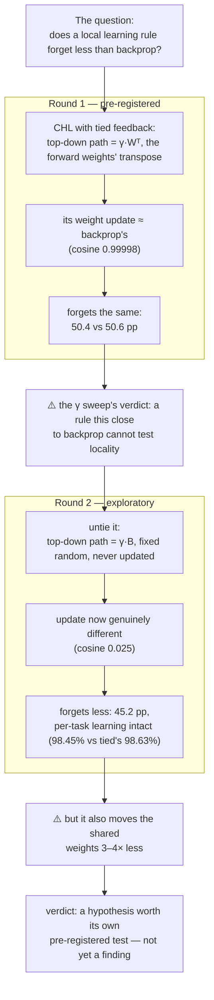

# Does locality help?

**Does a local learning rule forget less than backpropagation?**

Train a neural network on a second task and it bulldozes the first — *catastrophic
forgetting*. Brains do not seem to suffer from it nearly as badly, and one popular suspect
is *how* they learn: every synapse updates from signals available right where it is (a
**local** rule), instead of waiting for an error signal to be routed backward through the
whole network, which is what backpropagation does. That story is usually told
qualitatively. This repository measures it.

**Short answer: no.** In a pre-registered comparison, the local rule forgot just as much
as backprop. **The longer answer is better** — that null turned out to say less than
it seemed, and the follow-up it forced produced the most interesting number in the repo.

## The whole study, in one picture



*(CHL = Contrastive Hebbian Learning, the local rule under test; γ = feedback strength;
pp = percentage points; cosine = direction agreement between the two rules' weight
updates, 1 = identical, 0 = unrelated. Each is properly introduced below.)*

Everything below unpacks this picture, top to bottom.

## Round 1 — the pre-registered comparison

The local rule is **Contrastive Hebbian Learning** (CHL; Xie & Seung, 2003), implemented
from scratch in PyTorch and verified against the published theorem relating it to backprop
before being trusted with any experiment. The benchmark is **Split-MNIST**: handwritten
digits, cut into five two-digit tasks (0 vs 1, then 2 vs 3, …), trained strictly in that
order. *Pre-registered* means the whole design — metrics, seeds, tuning budget, expected
outcome — was committed before the experiment ran, so nothing could be quietly tuned after
seeing the numbers. One honest wrinkle, disclosed up front: the protocol below is the
*amended* design. The originally pre-registered protocol produced a floor effect — nothing
to measure — and was replaced by Amendment 1 *before* any rule comparison ran; the full
story is in the floor-effect subsection further down.

On **domain-incremental** Split-MNIST — a single shared output head for all five tasks, so every task's two digits map to labels 0/1 through the *same* output units and a later task can directly overwrite an earlier one's decision boundary, with task identity never given at test time — with an identical tuning budget and 3 seeds:

| rule | final accuracy | forgetting | joint-training ceiling |
|---|---|---|---|
| backprop | 57.90% ±0.42 | 50.59 pp ±0.67 | 89.75% |
| contrastive Hebbian | 58.03% ±0.36 | 50.35 pp ±0.75 | 89.84% |

> *pp = percentage points — a plain subtraction between two accuracies, not a relative percent change.*
> *Forgetting = for each of the first four tasks, its accuracy right after training that task minus its accuracy once all five are done, averaged across those tasks; positive means forgetting. Same ACC/forgetting formulation as Lopez-Paz & Ranzato's GEM paper — see `forgetlab/metrics.py`.*
> *Joint-training ceiling = the same network trained on all five tasks shuffled together instead of sequentially — an upper bound on what's achievable here, not a third method being compared.*


**The local learning rule forgets just as much as backpropagation.** With roughly 51 percentage points of forgetting available to separate them, CHL differs from backprop by only 0.24 pp — against seed-to-seed standard deviations of 0.67 pp (backprop) and 0.75 pp (CHL), on just 3 seeds. That gap is far smaller than the run-to-run noise: nothing here points to a real difference in either direction.

One thing this result is *not*:

- **This does not show that the brain's mechanisms do not help.** What was swapped is the *credit assignment* mechanism — the general problem of figuring out which weights caused an error, so only those get updated — holding everything else fixed. Replay, neuromodulation, sparsity and structural plasticity, all things brains have and this experiment does not, are untouched. The claim is narrow: locality of the learning rule, on its own, buys nothing here against catastrophic forgetting.

## How CHL learns

Before round 2 makes sense, one picture of the mechanism. CHL trains a network without
ever running a backward pass — it lets the network *settle*, twice: once with the output
left alone (the **free phase**), once with the output pinned to the correct answer (the
**clamped phase**). The difference between the two settled states is the weight update:


*The two settlings contrastive Hebbian learning subtracts to get its weight update — free phase vs. clamped phase — and the difference between them stabilising into the actual learning signal. Every frame above is a real `forgetlab.layers.LayeredNet.relax()` call on a tiny 3→4→2 network, not an illustration — captured one Euler step at a time and checked in-script against a direct multi-step `relax()` call. `gamma = 0.3` here only so the settling is visible on a human timescale; the actual experiment above uses `gamma = 0.1`, and the equivalence tests further down push `gamma` toward 0.*

CHL never computes a gradient — it measures one, by settling the network twice and comparing what it finds: first the clamped phase, then the free phase seeded from that clamped fixed point (Xie & Seung §4's prescribed order — see `forgetlab/layers.py`'s `settle_both_phases`). The animation above starts both phases from the same zero state instead, purely so it can show them pulling apart side by side; that is a deliberate simplification for this picture, not how the real training code settles the phases.

- **Free phase** (panel 1) — the input is held fixed, the output is left alone, and the network settles wherever the current weights take it. It does not land on the right answer; nothing has been learned yet.
- **Clamped phase** (panel 2) — the input *and* the correct answer are both held fixed. Only the hidden units are free, pulled by a `gamma * W^T` feedback path: the forward weights, transposed and scaled down by `gamma`.
- **The difference** (panel 3) — for each connection, subtract what its two endpoints were doing in the free phase from what they were doing in the clamped phase. Once that difference stops moving, it *is* the weight update — for the output layer, with one example, this is exactly the `db` term in `forgetlab/rules/chl.py`.

No error signal is ever computed and routed backward through the network. Every weight only ever sees activity local to its own two endpoints — which is what *local* means throughout this README. This repo first checks that the difference above is, in the right limit, mathematically identical to what backpropagation would compute for the same network (`tests/`, [`docs/limits.md`](docs/limits.md)) — then uses it to run the comparison above.

## Round 2 — the follow-up the null forced

Two exploratory studies came after the frozen result. Both designs and hypotheses were
committed before their runs, both are labelled exploratory, and neither carries
confirmatory weight — but this is where the story turns.

**First, the [γ sweep](docs/exploratory-gamma.md) found the blind spot.**
Feedback strength was varied 50-fold; forgetting
moved less than the random choice of initial weights moves it. The sweep also exposed the
frozen comparison's scope limit: across the whole range, tied CHL's update stays within
~2.5% of backprop's, so that comparison cannot separate "locality does not help" from
"this rule was not different enough from backprop to tell"
([`docs/limits.md`](docs/limits.md)).

**Then [untying the feedback](docs/exploratory-untied.md) closed it.**
Give the top-down path its own *fixed random* matrices instead of the forward weights'
transpose. The hidden-layer update's direction now genuinely differs from backprop's
(cosine similarity between the two update vectors: 0.99998 tied, 0.025 untied; the output
layer, under 0.3% of the parameters, stays aligned either way). Result, on 3 seeds: the
untied rule forgot **45.2 pp vs backprop's 50.6 pp**, at essentially equal per-task
attainment (accuracy on each task right after training it: 98.45% vs 98.63%) and with the
highest final accuracy of any arm.

Two caveats cap that, in opposite directions. The reduction travels together with a 3–4×
drop in how much the trunk — the shared 784→256 hidden weights — moves over the sequence,
and less trunk movement is a boring, sufficient mechanism for less interference. But the
control arm (tied weights, same missing rescaling factor) moves the trunk almost as little
(2.9% vs 2.4%) and still forgets 3.3 pp more than the untied arm, so trunk movement alone
does not explain the gap between those two. On 3 seeds this is **a hypothesis for a proper
pre-registered test, not a finding.**

What it does establish: make the rule genuinely different from backprop and the forgetting
numbers move — the frozen null was a statement about closeness to backprop, not about
locality.

## Why the network forgets: collapse onto the last task's rule

Forgetting is far from uniform across tasks — 89.5 pp for 4v5 but only 15.9 pp for 6v7 in the backprop run (CHL: 89.7 pp and 15.7 pp) — and the average hides why. `experiments/analyse_forgetting.py` trains a single domain-incremental backprop network on the same five-task sequence and asks which class the *final* network assigns to each original digit:

| task | digits | class assigned by the final net | own labels | task accuracy |
|---|---|---|---|---|
| 4v5 | 4, 5 | 1, 0 | 0, 1 | **9.2%** (below chance) |
| 0v1 | 0, 1 | 0, 0 | 0, 1 | 48.8% |
| 2v3 | 2, 3 | 0, 0 | 0, 1 | 50.1% |
| 6v7 | 6, 7 | 0, 1 | 0, 1 | **82.9%** |

The network is not retaining a weakened version of each old task. It has collapsed onto the last task's decision rule — "does this look more like an 8 or a 9?" — and an old task scores well only when its own label assignment happens to *agree* with that rule. 6 resembles 8 and 7 resembles 9, and both agree, so 6v7 survives. 4 resembles 9 and 5 resembles 8, and both disagree, so 4v5 lands below chance: the network is confidently, systematically inverted.

So the 89.5-vs-15.9 spread is not some tasks being more robust than others. Every task was overwritten equally; the spread is coincidental label alignment with whatever was trained last. Forgetting here is total overwriting plus luck, not graded decay — which also means per-task forgetting numbers should not be read as a memory-strength ranking.

### The task-incremental protocol: a floor effect

The originally pre-registered protocol was **task-incremental**: task identity is given at test time and each task gets its own private output head, so the network only ever has to pick between the two digits of the task it is currently told it is solving. Run first, it produced a floor effect: forgetting of −0.03 pp ±0.22 (backprop) and −0.11 pp ±0.28 (CHL), with accuracy at 98.36% (backprop) and 98.31% (CHL), and joint ceilings of 98.15% and 98.10% — both close enough to zero, given the noise on 3 seeds, that the small negative numbers should be read as sampling noise, not measured backward transfer. Separate heads plus transferable stroke features mean the tasks barely interfere, so this protocol cannot separate the rules at all — both land within noise of those ceilings and of each other. It is kept because "this benchmark has no signal" is itself worth recording — see Amendment 1 in [`docs/preregistration.md`](docs/preregistration.md), which is also why the domain-incremental protocol above was added.

## What this is / is not

- **Is:** a minimal, tested, readable implementation of one local learning rule, plus a small pre-registered replication of a specific literature claim.
- **Is not:** a new method, a state-of-the-art (SOTA) result, or a general-purpose library. There is no claim here that biologically-motivated learning rules are better than backprop at anything.

## Scope of the claim

On this architecture, on Split-MNIST, in these two settings, with an identical tuning budget, these two rules forgot this much. Nothing about depth, other datasets, class-incremental settings (a harder protocol, not run here, where the network must pick the right digit out of every digit seen so far, not just the current task's two), or language models.

### One scope change was made after the results were known

The original design compared **three** rules. Predictive coding was dropped after the numbers were in, because under the fixed-prediction assumption it computes *literally the same gradient* as backprop — verified to 2.8e-16 in float64. Its arm was a correctness check on the implementation, not an independent condition, and removing it changed no number for backprop or CHL. This is recorded as Amendment 2 in [`docs/preregistration.md`](docs/preregistration.md) rather than applied silently, and the three-rule results remain in the git history.

CHL's depth sensitivity is not tested in this project — no depth sweep is run here. That it degrades with depth is a premise carried over from the broader local-learning-rules literature this repo builds on, not something verified directly by this repo's own experiments. This experiment deliberately stays in the shallow regime where that literature says CHL works, which is exactly why it cannot speak to depth at all — that gap is part of the scope being disclosed, not an oversight.

## Install & reproduce

```bash
uv sync --extra dev
uv run pytest                                                          # 12 tests, ~7s
uv run python experiments/run_continual_comparison.py --protocol domain
uv run python experiments/run_continual_comparison.py --protocol task
uv run python experiments/analyse_forgetting.py                       # the collapse analysis above
uv run python experiments/animate_settling.py                         # regenerates the GIF above
```

CPU only — no GPU required at any point. Tests run in about 7 seconds; the two comparison experiments take a few minutes total.

## Use the implementation

This is not a general-purpose library, but the implementation is small and importable. To
train CHL on your own data:

```python
from forgetlab.layers import LayeredNet
from forgetlab.train import accuracy, train

net = LayeredNet([784, 256, 10], gamma=0.1, seed=0)          # tied=False for untied feedback
train(net, "chl", x_train, y_train, lr=0.1, epochs=10, batch_size=64, seed=0,
      rule_kwargs=dict(n_steps=64, dt=0.5, tol=1e-8))
print(accuracy(net, x_test, y_test))
```

`rule="backprop"` runs the reference rule through the identical training loop, so anything
you measure differs only by the update rule.

## Why this exists, and what it claims

Accounts of the brain stress that cortex learns **continuously and locally** from an
ongoing stream, while language models are trained **offline and globally** by
backpropagation and cannot absorb new examples without disturbing old weights. This
repository turns one narrow, testable slice of that contrast into something measurable.

The claim is deliberately small: a minimal, tested, PyTorch-native implementation of CHL,
validated against its equivalence theorem, used for controlled forgetting comparisons.
It is *not* "no CHL implementation exists" — several do, and they are credited below.

## Prior work

| Project | What it is | Why this repo is not it |
|---|---|---|
| [emer/leabra](https://github.com/emer/leabra) | O'Reilly's GeneRec; its symmetric-midpoint variant *is* CHL. The canonical implementation, taught for 25+ years via [compcogneuro.org](https://compcogneuro.org). | Full cognitive architecture in Go; CHL is buried inside it rather than isolated and testable. |
| [PsyNeuLink](https://princetonuniversity.github.io/PsyNeuLink/ContrastiveHebbianMechanism.html) | Princeton's cognitive-modelling toolkit, actively maintained, ships a first-class `ContrastiveHebbianMechanism`. | Modelling framework, not a PyTorch trainer; no equivalence-to-backprop test suite. |
| [Vivilux](https://github.com/NeuroSumbaD/Vivilux) | CHL on simulated photonic hardware. Actively maintained. | Hardware-specific. |
| [Dual-Propagation](https://github.com/Rasmuskh/Dual-Propagation) | An accelerated CHL variant using dyadic neurons (JAX/Julia). | A faster formulation. This repo implements the original 2003 equations deliberately, because the point is to test *that* theorem — pedagogical clarity over speed. |
| [Lillicrap et al. 2016](https://www.nature.com/articles/ncomms13276) | Feedback Alignment: random fixed feedback weights still support learning, because the forward weights align to them. | A different algorithm proving a different claim. "Still learns" is not "equals the backprop gradient", so round 1's comparison keeps the weights tied — and round 2's untied arm is this idea transplanted into a settling network. |

## Honest statement of the theorem's cost

Xie & Seung's equivalence is not free. It requires **infinitesimally weak feedback** (`γ → 0`) and, as a direct consequence, **per-layer learning rates that grow exponentially with distance from the output** (the `γ^(k-L)` factor in Eq. 2.8). Both are biologically awkward and are fair criticisms of the result. They are stated here rather than buried.

See [`docs/limits.md`](docs/limits.md) for exactly which theorem needs which limit, and why CHL's `γ` is not Equilibrium Propagation's `β`.

## Layout

The equivalence tests check three independent things — direction (per-layer cosine), scale
(per-layer norm ratio against the `γ^(k-L)` factor), and the theorem's predicted `O(γ)`
error rate — because either of the first two alone can pass on a broken implementation
that silently drops the `γ^(k-L)` term (see [`docs/limits.md`](docs/limits.md)).

```
docs/limits.md               which theorem needs which limit — and the measured scope limit
docs/preregistration.md      the frozen design, with its two amendments
docs/exploratory-gamma.md    the γ sweep
docs/exploratory-untied.md   the untied-feedback follow-up
forgetlab/layers.py          the settling network (tied or untied feedback)
forgetlab/rules/             backprop (reference), CHL
forgetlab/metrics.py         ACC, forgetting, per-layer gradient alignment
experiments/                 comparison driver, guard scripts, the settling-GIF generator
tests/                       equivalence anchors, untied anchors, sanity checks
```

## License

MIT
