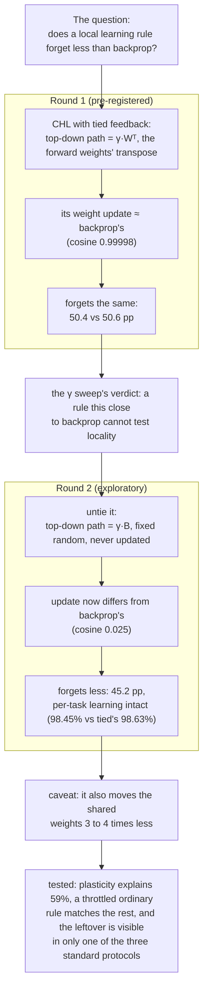
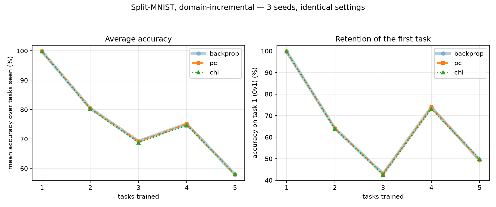
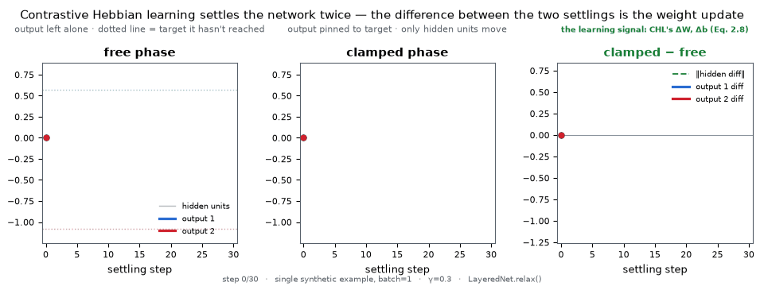

# Does locality help?

**Does a local learning rule forget less than backpropagation?**

Train a network on a second task and it bulldozes the first. The literature calls this
*catastrophic forgetting*. Brains cope with sequential learning far better, and one
suspect is the learning rule itself: each synapse in a brain updates from signals
available at its own two ends (a **local** rule), while backpropagation routes an error
signal backward through the whole network. That argument circulates in textbooks and blog
posts without a measurement attached. This repository attaches one.

The pre-registered comparison found no difference: on this one benchmark, with this one
rule, the local rule forgot as much as backprop. Round 2 showed why even that says little
about locality. The round 1 rule turned out to be a near-copy of backprop, and a version
with the copying removed forgot less. A third study then tested whether that gap was
really about the rule: most of it is explained by the version simply moving its weights
less, and throttling the ordinary rule the same way matches it. Nothing here settles the
question in the title; the repo measures what it can and labels the rest.

**This project is finished.** What it found, what it failed to explain, and why it could not
go further are all in the write-up below.

## The whole study, in one picture



*(CHL = Contrastive Hebbian Learning, the local rule under test; γ = feedback strength;
pp = percentage points; cosine = direction agreement between the two rules' weight
updates, 1 = identical, 0 = unrelated. The sections below define each one in place.)*

## Round 1: the pre-registered comparison

The local rule is **Contrastive Hebbian Learning** (CHL; Xie & Seung, 2003). I
implemented it from scratch in PyTorch and tested it against the published theorem that
ties it to backprop before trusting it with any experiment. The benchmark is
**Split-MNIST**: handwritten digits, cut into five two-digit tasks (0 vs 1, then 2 vs 3,
and so on), trained in that order. Pre-registration means the design went into a commit
before the experiment ran: metrics, seeds, tuning budget, expected outcome. You cannot
tune one method harder after seeing the numbers if the numbers come last.

One wrinkle, stated up front. The protocol below is the amended design. The original
protocol produced a floor effect, near-zero forgetting for either rule, and Amendment 1
replaced it before any rule comparison ran. The floor-effect subsection below tells that
story.

The protocol is **domain-incremental**: one shared output head for all five tasks, so
each task maps its two digits to labels 0/1 through the same output units, and a later
task can overwrite an earlier one's decision boundary. The test never reveals which task
an image came from. Identical tuning budget, 3 seeds:

| rule | final accuracy | forgetting | joint-training ceiling |
|---|---|---|---|
| backprop | 57.90% ±0.42 | 50.59 pp ±0.67 | 89.75% |
| contrastive Hebbian | 58.03% ±0.36 | 50.35 pp ±0.75 | 89.84% |

> *pp = percentage points, a plain subtraction between two accuracies, not a relative
> percent change.*
> *Forgetting: for each of the first four tasks, take its accuracy right after training
> that task, subtract its accuracy once all five are done, and average. Positive means
> forgetting. Same formulation as Lopez-Paz & Ranzato's GEM paper; see
> `forgetlab/metrics.py`.*
> *Joint-training ceiling: the same network trained on all five tasks shuffled together
> instead of sequentially. An upper bound, not a competitor.*



**On this benchmark, the local rule forgets as much as backpropagation.** The benchmark offers 51 percentage
points of forgetting to separate the two rules. They land 0.24 pp apart, with seed-to-seed
standard deviations of 0.67 pp and 0.75 pp. The gap sits inside the noise.

Read the result at its correct size. The experiment swapped one thing, the
*credit-assignment* mechanism: the machinery that decides which weights caused an error.
Replay, neuromodulation, sparsity, structural plasticity: brains have all of these, this
experiment has none of them, and the result says nothing about them. Locality of the
learning rule, on its own, bought nothing here against catastrophic forgetting.

## How CHL learns

Round 2 modifies CHL's feedback path, so first, what that path does. CHL trains a network
without a backward pass. It settles the network twice: once with the output left alone
(the **free phase**), once with the output pinned to the correct answer (the **clamped
phase**). The difference between the two settled states is the weight update:



*Free phase, clamped phase, and their difference stabilising into the learning signal.
Every frame comes from a real `forgetlab.layers.LayeredNet.relax()` call on a tiny 3→4→2
network, captured one Euler step at a time and checked in-script against a direct
multi-step `relax()` call. This picture uses `gamma = 0.3` so the settling is visible at
human speed; the experiments use `gamma = 0.1`, and the equivalence tests push `gamma`
toward 0.*

CHL never computes a gradient. It measures one. The real training code settles the
clamped phase first, then seeds the free phase from that clamped fixed point, the order
Xie & Seung §4 prescribes (see `settle_both_phases` in `forgetlab/layers.py`). The
animation starts both phases from the same zero state instead, so you can watch them pull
apart side by side; the code does not train that way.

- **Free phase** (panel 1): hold the input fixed, leave the output alone, and the network
  settles wherever its current weights take it. Nothing has been learned yet, so it lands
  short of the right answer.
- **Clamped phase** (panel 2): hold the input *and* the correct answer fixed. Hidden
  units settle under a `gamma * W^T` feedback path, the forward weights transposed and
  scaled down by `gamma`.
- **The difference** (panel 3): for each connection, subtract free-phase activity from
  clamped-phase activity at its two endpoints. Once that difference stops moving, it *is*
  the weight update. For the output layer with one example this is the exact `db` term in
  `forgetlab/rules/chl.py`.

No error signal travels backward through the network. Each weight sees activity at its
own two endpoints and nothing else, which is what *local* means throughout this README.
The test suite checks that this difference matches, in the right limit, what
backpropagation would compute for the same network (`tests/`,
[`docs/limits.md`](docs/limits.md)).

## Round 2: exploratory follow-ups

Three exploratory studies followed the frozen result. Each design and hypothesis went into
a commit before its runs. None carries confirmatory weight. Together they say more than
round 1 did.

**Step one, the [γ sweep](docs/exploratory-gamma.md).** I varied the feedback strength
across a 50-fold range. Forgetting moved less than the random choice of initial weights
moves it. The sweep also produced a more important number: across that whole range, tied
CHL's update stays within 2.5% of backprop's. Rules that close cannot answer the locality
question; the round 1 comparison could not separate "locality does not help" from "these
two rules were near-twins" ([`docs/limits.md`](docs/limits.md)).

**Step two, [untied feedback](docs/exploratory-untied.md).** I gave the top-down path its
own fixed random matrices in place of the forward weights' transpose. The hidden-layer
update now points somewhere else: cosine against backprop's update drops from 0.99998
(tied) to 0.025 (untied), while the output layer, under 0.3% of the parameters, stays
aligned either way. On 3 seeds, the untied rule forgot **45.2 pp against backprop's
50.6 pp**, matched the tied rule on each task right after training it (98.45% vs 98.63%
accuracy), and finished the sequence with the highest final accuracy of
any arm.

That number needed a caveat, and the caveat has since been tested, at 5 seeds, which re-measured
both arms and shifted them slightly (the standard rule to 50.47 pp, untied to 44.77 pp). The untied rule also
moves the trunk, the shared 784→256 hidden weights, three to four times less over the
sequence, and a trunk that moves less interferes less for reasons having nothing to do with
credit assignment. **Step three, [the plasticity curve](docs/exploratory-plasticity.md),**
throttled the ordinary tied rule through seven settings to trace forgetting against trunk
movement, then placed the untied arm on that curve, at 5 seeds.

The curve turned out flat over most of its range: cutting trunk movement from 9.9% to 5.3%
changes forgetting not at all, and the dependence appears only below about 5%. The untied
arm lands 2.34 pp below the curve at its own trunk movement, so plasticity accounts for 59%
of its advantage and a residual survives matching. That residual held when the seed count
was tripled: 2.38 pp at 15 seeds against 2.34 pp at 5. It is a real effect, and three
attempts to find its mechanism have all failed. A tied rule throttled far enough still
reaches 43.93 pp forgetting at 62.8% accuracy, beating untied on both with no untying at
all, so turning plasticity down remains the simpler route to the same place.

A rule that far from the gradient still learns, and the reason is measured rather than
assumed: over training the forward weights rotate toward the fixed random feedback, and
the update the rule delivers climbs from 0 to about 0.5 cosine against the true gradient
while accuracy climbs from chance to 83.8%. The alignment stays partial, roughly 60° off
the gradient at the end, which is the weaker condition descent actually needs
([`docs/exploratory-untied.md`](docs/exploratory-untied.md)).

What round 2 does establish: change the rule into something measurably different from
backprop and the forgetting numbers move. Round 1's null described how close the two
rules were to each other. It never reached the question of locality.

## Round 3, and where this stopped

Two questions remained: what mechanism produces the leftover 2.4 pp, and whether the
effect exists outside this one setup. Both were pursued, and the second is what ended the
project.

**The mechanism resisted five attempts**, four of them recorded as failures in
[`docs/exploratory-plasticity.md`](docs/exploratory-plasticity.md). One located the effect.
Freezing the shared trunk after the first task still leaves 43.5 pp of forgetting, so
the two-unit output head causes about 86% of it and both rules pay that equally, while the
rules differ only in what their trunk updates add. The nearest thing to an explanation is
negative: the residual needs the feedback matrix to be *unrelated to the forward path*, not
merely fixed. A frozen copy of the initial forward weights lands on the plasticity curve
with no residual at all.

**Then the generalisation test saturated.** Widening the output head to ten units and
running class-incremental, the third protocol in the standard taxonomy and deliberately
out of scope until now, produced a ceiling effect exactly mirroring the floor effect that
forced Amendment 1. Every arm learns every task at 98.5% and then forgets essentially all
of it: 98.7 pp forgetting, 19.3% final accuracy, four arms spanning 0.22 pp against a
possible 99 ([`docs/exploratory-class-incremental.md`](docs/exploratory-class-incremental.md)).

So the finding is confined to one window:

> The untied rule's advantage exists in domain-incremental Split-MNIST, which is the only
> one of the three standard protocols with measurement room at this architecture and
> budget. Task-incremental leaves nothing to forget; class-incremental leaves nothing to
> retain.

An effect visible through only one window is not thereby false, but it cannot be resolved
from inside this project. Relieving the ceiling needs more data, more capacity and a
retuned budget, which would break the frozen identical-tuning-budget discipline that makes
the original comparison trustworthy in the first place. That is a larger experiment, not a
continuation of this one.

**The project stops here**, with the effect measured, its scope stated, its mechanism
unfound, and the four eliminated explanations left on record for anyone who picks it up.
## Why the network forgets: collapse onto the last task's rule

Forgetting is uneven across tasks: 89.5 pp for 4v5, 15.9 pp for 6v7 in the backprop run
(CHL: 89.7 and 15.7). The average hides the reason. `experiments/analyse_forgetting.py`
asks the final network which class it assigns to each original digit:

| task | digits | class assigned by the final net | own labels | task accuracy |
|---|---|---|---|---|
| 4v5 | 4, 5 | 1, 0 | 0, 1 | **9.2%** (below chance) |
| 0v1 | 0, 1 | 0, 0 | 0, 1 | 48.8% |
| 2v3 | 2, 3 | 0, 0 | 0, 1 | 50.1% |
| 6v7 | 6, 7 | 0, 1 | 0, 1 | **82.9%** |

The network keeps no weakened copy of each old task. It has collapsed onto the last
task's decision rule ("does this look more like an 8 or a 9?"), and an old task scores
well only when its own labels happen to agree with that rule. 6 resembles 8, 7 resembles
9, both agree, and 6v7 survives. 4 resembles 9, 5 resembles 8, both disagree, and 4v5
lands below chance: the network inverts its answers with full confidence.

So the 89.5-vs-15.9 spread says nothing about some tasks being tougher than others. The
last task overwrote every one of them; the spread comes from which label assignments
happen to line up with the final rule. Forgetting here is total overwriting plus luck.
Read the per-task numbers as label luck, never as a memory-strength ranking.

### The task-incremental protocol: a floor effect

The original pre-registered protocol was **task-incremental**: the test reveals which
task an image came from, and each task gets its own private output head, so the network
picks between two digits it already knows it should be choosing between. Run first, this
produced a floor effect: forgetting of −0.03 pp ±0.22 (backprop) and −0.11 pp ±0.28
(CHL), accuracy at 98.36% and 98.31%, joint ceilings at 98.15% and 98.10%. Read the small
negative numbers as sampling noise on 3 seeds, and skip any backward-transfer story.
Separate heads plus transferable stroke features keep the tasks from interfering, so this
protocol cannot separate the rules at all; both land within noise of those ceilings and
of each other. It stays in the repo because "this benchmark has no signal" is worth
recording. See Amendment 1 in [`docs/preregistration.md`](docs/preregistration.md), which
is also why the domain-incremental protocol above exists.

## What this is / is not

- **Is:** a minimal, tested, readable implementation of one local learning rule, plus a
  small pre-registered replication of a specific literature claim.
- **Is not:** a new method, a state-of-the-art (SOTA) result, or a general-purpose
  library. Nothing here claims that biologically-motivated learning rules beat backprop
  at anything.

## Scope of the claim

On this architecture, on Split-MNIST, in these two settings, with an identical tuning
budget, these two rules forgot this much. Nothing about depth, other datasets,
class-incremental settings (a harder protocol, absent here, where the network must pick
the right digit out of every digit seen so far), or language models.

### One scope change came after the results were known

The original design compared **three** rules. I dropped predictive coding after the
numbers were in, because under the fixed-prediction assumption it computes the same
gradient as backprop, verified to 2.8e-16 in float64. Its arm was a correctness check on
the implementation, and removing it changed no number for backprop or CHL. Amendment 2 in
[`docs/preregistration.md`](docs/preregistration.md) records the change, and the
three-rule results remain in the git history.

This project runs no depth sweep, so CHL's depth sensitivity goes untested here. That CHL
degrades with depth is a premise carried over from the local-learning-rules literature,
and the experiment stays in the shallow regime where that literature says CHL works. The
same choice that keeps CHL working keeps this repo silent about depth. The repo
discloses that gap instead of hiding it.

## Install & reproduce

```bash
uv sync --extra dev
uv run pytest                                                          # 12 tests, ~7s
uv run python experiments/run_continual_comparison.py --protocol domain
uv run python experiments/run_continual_comparison.py --protocol task
uv run python experiments/analyse_forgetting.py                       # the collapse analysis above
uv run python experiments/animate_settling.py                         # regenerates the GIF above
```

CPU only; no GPU needed at any point. The tests run in about 7 seconds, and the two
comparison experiments take a few minutes total.

## Use the implementation

The repo is not a general-purpose library, but the implementation is small and importable. To
train CHL on your own data:

```python
from forgetlab.layers import LayeredNet
from forgetlab.train import accuracy, train

net = LayeredNet([784, 256, 10], gamma=0.1, seed=0)          # tied=False for untied feedback
train(net, "chl", x_train, y_train, lr=0.1, epochs=10, batch_size=64, seed=0,
      rule_kwargs=dict(n_steps=64, dt=0.5, tol=1e-8))
print(accuracy(net, x_test, y_test))
```

`rule="backprop"` runs the reference rule through the identical training loop, so
anything you measure differs by the update rule alone.

## Why this exists, and what it claims

Textbook accounts say cortex learns from a continuous stream through local rules, while
engineers train language models offline with backpropagation, and a trained model cannot
absorb new examples without disturbing old weights. This repository takes one narrow,
testable slice of that contrast and measures it.

The claim stays small: a minimal, tested, PyTorch-native implementation of CHL, validated
against its equivalence theorem, used for controlled forgetting comparisons. Several CHL
implementations predate this one, and the table below credits them.

## Prior work

| Project | What it is | Why this repo is not it |
|---|---|---|
| [emer/leabra](https://github.com/emer/leabra) | O'Reilly's GeneRec; its symmetric-midpoint variant *is* CHL. The canonical implementation, taught for 25+ years via [compcogneuro.org](https://compcogneuro.org). | Full cognitive architecture in Go; CHL is buried inside it rather than isolated and testable. |
| [PsyNeuLink](https://princetonuniversity.github.io/PsyNeuLink/ContrastiveHebbianMechanism.html) | Princeton's cognitive-modelling toolkit, actively maintained, ships a first-class `ContrastiveHebbianMechanism`. | Modelling framework, not a PyTorch trainer; no equivalence-to-backprop test suite. |
| [Vivilux](https://github.com/NeuroSumbaD/Vivilux) | CHL on simulated photonic hardware. Actively maintained. | Hardware-specific. |
| [Dual-Propagation](https://github.com/Rasmuskh/Dual-Propagation) | An accelerated CHL variant using dyadic neurons (JAX/Julia). | A faster formulation. This repo implements the original 2003 equations on purpose, because the point is to test *that* theorem: clarity over speed. |
| [Lillicrap et al. 2016](https://www.nature.com/articles/ncomms13276) | Feedback Alignment: random fixed feedback weights still support learning, because the forward weights align to them. | A different algorithm proving a different claim. "Still learns" is not "equals the backprop gradient", so round 1's comparison keeps the weights tied; round 2's untied arm transplants this idea into a settling network. |

## Honest statement of the theorem's cost

Xie & Seung's equivalence is not free. It requires **infinitesimally weak feedback**
(`γ → 0`) and, as a direct consequence, **per-layer learning rates that grow
exponentially with distance from the output** (the `γ^(k-L)` factor in Eq. 2.8). Both are
biologically awkward, and both are fair criticisms of the result. This README states them
instead of burying them.

See [`docs/limits.md`](docs/limits.md) for which theorem needs which limit, and why CHL's
`γ` differs from Equilibrium Propagation's `β`.

## Layout

The equivalence tests check three independent things: direction (per-layer cosine), scale
(per-layer norm ratio against the `γ^(k-L)` factor), and the theorem's predicted `O(γ)`
error rate. Either of the first two alone can pass on a broken implementation that
silently drops the `γ^(k-L)` term (see [`docs/limits.md`](docs/limits.md)).

```
docs/limits.md                 which theorem needs which limit, and the measured scope limit
docs/preregistration.md        the frozen design, with its two amendments
docs/exploratory-gamma.md      the γ sweep
docs/exploratory-untied.md     the untied-feedback follow-up
docs/exploratory-class-incremental.md  the generalisation test that saturated
docs/exploratory-plasticity.md is the untied result just lower plasticity?
forgetlab/layers.py            the settling network (tied or untied feedback)
forgetlab/rules/               backprop (reference), CHL
forgetlab/metrics.py           ACC, forgetting, per-layer gradient alignment
experiments/                   comparison driver, guard scripts, the settling-GIF generator
tests/                         equivalence anchors, untied anchors, sanity checks
```

## License

MIT
